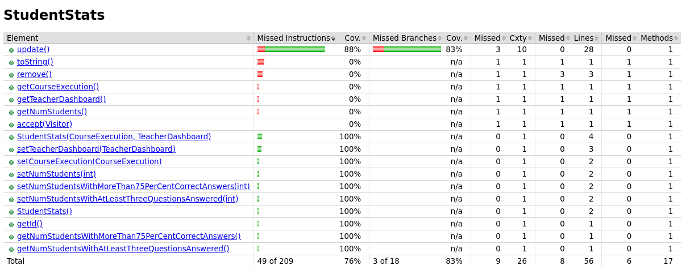
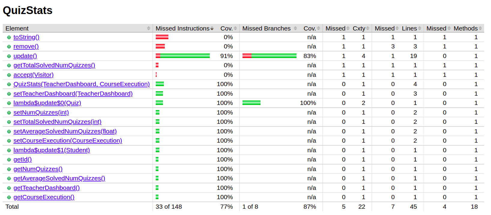
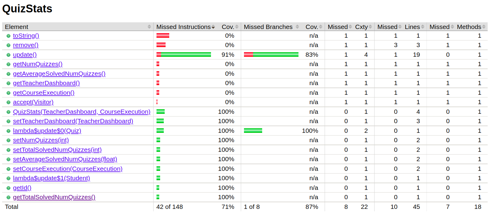
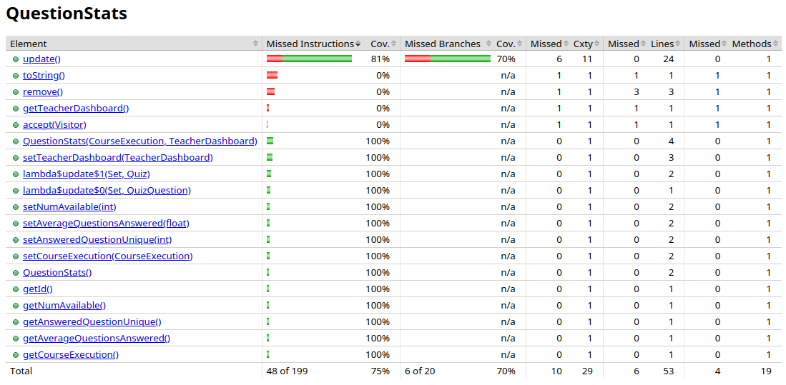

# ES P1 submission, Group 59

## Feature ESA

### Subgroup
- Inês Duarte, 99237, [GitLab link](https://gitlab.rnl.tecnico.ulisboa.pt/ist199237)
  + Issues assigned: [#5](https://gitlab.rnl.tecnico.ulisboa.pt/es/es/es23-59/-/issues/5), [#2](https://gitlab.rnl.tecnico.ulisboa.pt/es/es23-59/-/issues/2), [#27](https://gitlab.rnl.tecnico.ulisboa.pt/es/es23-59/-/issues/27), [#32](https://gitlab.rnl.tecnico.ulisboa.pt/es/es23-59/-/issues/32), [#35](https://gitlab.rnl.tecnico.ulisboa.pt/es/es23-59/-/issues/35), [#36](https://gitlab.rnl.tecnico.ulisboa.pt/es/es23-59/-/issues/36), [#37](https://gitlab.rnl.tecnico.ulisboa.pt/es/es23-59/-/issues/37), [#38](https://gitlab.rnl.tecnico.ulisboa.pt/es/es23-59/-/issues/38), [#39](https://gitlab.rnl.tecnico.ulisboa.pt/es/es23-59/-/issues/39)
- Pedro Martins, 99303, [GitLab link](https://gitlab.rnl.tecnico.ulisboa.pt/ist199303)
   + Issues assigned: [#5](https://gitlab.rnl.tecnico.ulisboa.pt/es/es/es23-59/-/issues/5), [#2](https://gitlab.rnl.tecnico.ulisboa.pt/es/es23-59/-/issues/2), [#27](https://gitlab.rnl.tecnico.ulisboa.pt/es/es23-59/-/issues/27), [#32](https://gitlab.rnl.tecnico.ulisboa.pt/es/es23-59/-/issues/32), [#35](https://gitlab.rnl.tecnico.ulisboa.pt/es/es23-59/-/issues/35), [#36](https://gitlab.rnl.tecnico.ulisboa.pt/es/es23-59/-/issues/36), [#37](https://gitlab.rnl.tecnico.ulisboa.pt/es/es23-59/-/issues/37), [#38](https://gitlab.rnl.tecnico.ulisboa.pt/es/es23-59/-/issues/38), [#39](https://gitlab.rnl.tecnico.ulisboa.pt/es/es23-59/-/issues/39)
 
### Merge requests associated with this feature

The list of pull requests associated with this feature is:

- [MR #1 : ESA 1.1 - Total number of students](https://gitlab.rnl.tecnico.ulisboa.pt/es/-/merge_requests/6)
- [MR #2 : ESA 1.2 - Number of students who have answered more than 75% of the questions correct](https://gitlab.rnl.tecnico.ulisboa.pt/es/es23-59/-/merge_requests/7)
- [MR #3 : ESA 1.3 - Number of students who have solved, at least, 3 quizzes](https://gitlab.rnl.tecnico.ulisboa.pt/es/es23-59/-/merge_requests/8)

### Test Coverage Screenshot

The screenshot includes the test coverage results associated with the new/changed entities:

---

## Feature ESQ

### Subgroup
 - Pedro Chaparro, 99298, [GitLab link](https://gitlab.rnl.tecnico.ulisboa.pt/ist199298)
   + Issues assigned: [#4](https://gitlab.rnl.tecnico.ulisboa.pt/es/es23-59/-/issues/4), [#6](https://gitlab.rnl.tecnico.ulisboa.pt/es/es23-59/-/issues/6), [#22](https://gitlab.rnl.tecnico.ulisboa.pt/es/es23-59/-/issues/22), [#24](https://gitlab.rnl.tecnico.ulisboa.pt/es/es23-59/-/issues/24), [#26](https://gitlab.rnl.tecnico.ulisboa.pt/es/es23-59/-/issues/26)
 - Bernardo Prata, 99184, [GitLab link](https://gitlab.rnl.tecnico.ulisboa.pt/ist199184)
   + Issues assigned: [#4](https://gitlab.rnl.tecnico.ulisboa.pt/es/es23-59/-/issues/4), [#10](https://gitlab.rnl.tecnico.ulisboa.pt/es/es23-59/-/issues/10), [#21](https://gitlab.rnl.tecnico.ulisboa.pt/es/es23-59/-/issues/21), [#23](https://gitlab.rnl.tecnico.ulisboa.pt/es/es23-59/-/issues/23), [#25](https://gitlab.rnl.tecnico.ulisboa.pt/es/es23-59/-/issues/25), [#34](https://gitlab.rnl.tecnico.ulisboa.pt/es/es23-59/-/issues/34)
 
### Merge requests associated with this feature

The list of pull requests associated with this feature is:

 - [MR #1: ESQ 1.1 - Total number of available quizzes](https://gitlab.rnl.tecnico.ulisboa.pt/es/es23-59/-/merge_requests/1)
 - [MR #2: ESQ 1.2 - Total number of unique quizzes solved by students](https://gitlab.rnl.tecnico.ulisboa.pt/es/es23-59/-/merge_requests/2)
 - [MR #3: ESQ 1.3 - Average number of quizzes solved by student](https://gitlab.rnl.tecnico.ulisboa.pt/es/es23-59/-/merge_requests/3)

### Test Coverage Screenshot

The screenshots includes the test coverage results associated with the new/changed entities.
  
Since testing the methods `toString()`, `remove()` and `accept()` wasn't mandatory (mentioned in Slack), the sub-group decided to not test them.
    
The first screenshot shows all the methods being tested, except for `getTotalSolvedNumQuizzes()`.  

The second screenshot shows the method `getTotalSolvedNumQuizzes()` being tested (Result of testing the file `GetTotalSolvedUniqueQuizzes.groovy` individually. Problem discussed with the Lab's Professor).

---

## Feature ESP

### Subgroup
 - Bruno Campos, 99187, [GitLab link](https://gitlab.rnl.tecnico.ulisboa.pt/ist199187)
   + Issues assigned: [#29](https://gitlab.rnl.tecnico.ulisboa.pt/es/es23-59/-/issues/29), [#12](https://gitlab.rnl.tecnico.ulisboa.pt/es/es23-59/-/issues/12), [#11](https://gitlab.rnl.tecnico.ulisboa.pt/es/es23-59/-/issues/11), [#31](https://gitlab.rnl.tecnico.ulisboa.pt/es/es23-59/-/issues/31), [#15](https://gitlab.rnl.tecnico.ulisboa.pt/es/es23-59/-/issues/15), [#16](https://gitlab.rnl.tecnico.ulisboa.pt/es/es23-59/-/issues/16)
 - Orlando Dutra, 99295, [GitLab link](https://gitlab.rnl.tecnico.ulisboa.pt/ist199295)
   + Issues assigned: [#30](https://gitlab.rnl.tecnico.ulisboa.pt/es/es23-59/-/issues/30), [#13](https://gitlab.rnl.tecnico.ulisboa.pt/es/es23-59/-/issues/13), [#14](https://gitlab.rnl.tecnico.ulisboa.pt/es/es23-59/-/issues/14), [#31](https://gitlab.rnl.tecnico.ulisboa.pt/es/es23-59/-/issues/31), [#15](https://gitlab.rnl.tecnico.ulisboa.pt/es/es23-59/-/issues/15), [#16](https://gitlab.rnl.tecnico.ulisboa.pt/es/es23-59/-/issues/16)
 
### Merge requests associated with this feature

The list of pull requests associated with this feature is:

 - [MR #1: ESP 1.1 - Total number of available questions](https://gitlab.rnl.tecnico.ulisboa.pt/es/es23-59/-/merge_requests/5)
 - [MR #2: ESP 1.2 - Total number of unique questions answered by students](https://gitlab.rnl.tecnico.ulisboa.pt/es/es23-59/-/merge_requests/9)
 - [MR #3: ESP 1.3 - Average number of unique questions answered by student]()

### Test Coverage Screenshot

The screenshot includes the test coverage results associated with the new/changed entities:

---
