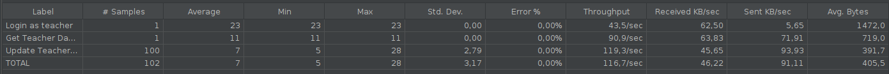

# ES P3 submission, Group NN

## Did your group use the base code provided?

Yes / No

## Feature ESA

### Subgroup
 - Name, istID, [GitLab link](https://gitlab.rnl.tecnico.ulisboa.pt/istXXXXXX)
   + Issues assigned: [#1](https://gitlab.rnl.tecnico.ulisboa.pt/es), [#3](https://gitlab.rnl.tecnico.ulisboa.pt/es)
 - Name, istID, [GitLab link](https://gitlab.rnl.tecnico.ulisboa.pt/istXXXXXX)
   + Issues assigned: [#2](https://gitlab.rnl.tecnico.ulisboa.pt/es), [#4](https://gitlab.rnl.tecnico.ulisboa.pt/es)
 
### Merge requests associated with this feature

The list of pull requests associated with this feature is:

 - [MR #1](https://gitlab.rnl.tecnico.ulisboa.pt/es)
 - [MR #2](https://gitlab.rnl.tecnico.ulisboa.pt/es)
 - [MR #3](https://gitlab.rnl.tecnico.ulisboa.pt/es)

### JMeter Load test

  - JMeter test: get
  
  - JMeter test: update
  
  - JMeter test: create → remove
  

### Cypress end-to-end tests

- Data initialization: explain how and where you have initialized the data for your tests.

- [Cypress test 1](https://gitlab.rnl.tecnico.ulisboa.pt/es)
- [Cypress test 2](https://gitlab.rnl.tecnico.ulisboa.pt/es)
- [Cypress test 3](https://gitlab.rnl.tecnico.ulisboa.pt/es)

---

## Feature ESQ

### Subgroup
 - Pedro Chaparro, 99298, [GitLab link](https://gitlab.rnl.tecnico.ulisboa.pt/ist199298)
   + Issues assigned: [#65](https://gitlab.rnl.tecnico.ulisboa.pt/es/es23-59/-/issues/65), [#68](https://gitlab.rnl.tecnico.ulisboa.pt/es/es23-59/-/issues/68), [#69](https://gitlab.rnl.tecnico.ulisboa.pt/es/es23-59/-/issues/46), [#48](https://gitlab.rnl.tecnico.ulisboa.pt/es/es23-59/-/issues/69)
 - Bernardo Prata, 99184, [GitLab link](https://gitlab.rnl.tecnico.ulisboa.pt/ist199184)
   + Issues assigned: [#64](https://gitlab.rnl.tecnico.ulisboa.pt/es/es23-59/-/issues/64), [#66](https://gitlab.rnl.tecnico.ulisboa.pt/es/es23-59/-/issues/66), [#46](https://gitlab.rnl.tecnico.ulisboa.pt/es/es23-59/-/issues/46), [#67](https://gitlab.rnl.tecnico.ulisboa.pt/es/es23-59/-/issues/67)
 
### Merge requests associated with this feature

The list of pull requests associated with this feature is:

 - [MR #1 : Esq 3.1 - The teacher can see Quizzes Statistics from the current and 2 previous Course Executions](https://gitlab.rnl.tecnico.ulisboa.pt/es/es23-59/-/merge_requests/17)

### JMeter Load test

  - JMeter test: update
  
   
### Cypress end-to-end tests

  TODO @prata
- Data initialization: explain how and where you have initialized the data for your tests.

  TODO @prata
- [Cypress test 1](https://gitlab.rnl.tecnico.ulisboa.pt/es)
- [Cypress test 2](https://gitlab.rnl.tecnico.ulisboa.pt/es)
- [Cypress test 3](https://gitlab.rnl.tecnico.ulisboa.pt/es)

---

## Feature ESP

### Subgroup
 - Name, istID, [GitLab link](https://gitlab.rnl.tecnico.ulisboa.pt/istXXXXXX)
   + Issues assigned: [#1](https://gitlab.rnl.tecnico.ulisboa.pt/es), [#3](https://gitlab.rnl.tecnico.ulisboa.pt/es)
 - Name, istID, [GitLab link](https://gitlab.rnl.tecnico.ulisboa.pt/istXXXXXX)
   + Issues assigned: [#2](https://gitlab.rnl.tecnico.ulisboa.pt/es), [#4](https://gitlab.rnl.tecnico.ulisboa.pt/es)
 
### Merge requests associated with this feature

The list of pull requests associated with this feature is:

 - [MR #1](https://gitlab.rnl.tecnico.ulisboa.pt/es)
 - [MR #2](https://gitlab.rnl.tecnico.ulisboa.pt/es)
 - [MR #3](https://gitlab.rnl.tecnico.ulisboa.pt/es)

### JMeter Load test

  - JMeter test: get
  
  - JMeter test: update
  
  - JMeter test: create → remove
  

### Cypress end-to-end tests

- Data initialization: explain how and where you have initialized the data for your tests.

- [Cypress test 1](https://gitlab.rnl.tecnico.ulisboa.pt/es)
- [Cypress test 2](https://gitlab.rnl.tecnico.ulisboa.pt/es)
- [Cypress test 3](https://gitlab.rnl.tecnico.ulisboa.pt/es)

---